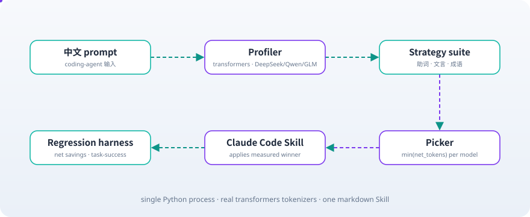

<div align="right"><strong>English</strong> | [简体中文](./README.md)</div>

<div align="center">

<picture>
  <source media="(prefers-color-scheme: dark)" srcset="assets/hero-dark.svg">
  
</picture>

<p><sub>The per-tokenizer 中文 prompt-compression Skill for DeepSeek / Qwen / GLM coding agents — the same Chinese prompt costs &gt;5% different tokens per domestic model, so wenyan measures and picks the winning compression strategy per model.</sub></p>

<p>
  <a href="./LICENSE"></a>
  
  
  
  
  
</p>

</div>

**caveman saves ~65% of English prompt tokens by truncating function words; Chinese has no spaces and no strip-able function words — wenyan picks up the surface caveman structurally cannot.**

##  Architecture

<picture>
  <source media="(prefers-color-scheme: dark)" srcset="assets/atlas-dark.svg">
  
</picture>

A single Python process plus one markdown Skill: real `transformers` tokenizers measure each domestic model's Chinese subword split, the strategy with the lowest net tokens per model is picked, and a Claude Code Skill applies the measured winner per detected model.

## Table of contents

- [Why this exists](#why-this-exists)
- [Install & Quickstart](#install--quickstart)
- [Usage](#usage)
- [Demo](#demo)
- [Configuration](#configuration)
- [Roadmap](#roadmap)
- [License](#license)

## Why this exists

caveman (the 94K-star English token-compression Skill by [@JuliusBrussee](https://github.com/JuliusBrussee)) proved the primitive — but its mechanism (space-delimited function-word truncation) has nothing to bite in Chinese. The same 中文 prompt costs different tokens on DeepSeek (32K BBPE, splits Chinese into more subwords), Qwen and GLM (151K vocabs, denser Chinese splits), so no single global rewrite is optimal. wenyan is the same Skill primitive wired to the domestic-model tokenizer difference and three Chinese compression primitives (文言文 densification / 助词 particle-stripping / 成语 substitution). As a Coding Agent token-compression layer for DeepSeek/Qwen/GLM (cf. [Hmbown/CodeWhale](https://github.com/Hmbown/CodeWhale)) and a companion to Agent runtimes like [NousResearch/hermes-agent](https://github.com/NousResearch/hermes-agent), wenyan profiles each tokenizer and picks the per-model winner — an owned layer caveman's English code structurally cannot cover, not a Chinese re-skin.

## Install & Quickstart

```bash
git clone https://github.com/SuperMarioYL/wenyan && cd wenyan
uv pip install -e .
wenyan profile --suite          # per-model tokens + variance % + 助词 net
```

<details><summary>Sample output</summary>

```
                        wenyan · per-tokenizer 中文 profile
┏━━━━━━━━━━┳━━━━━━━━━━━━━━━━━━━━━┳━━━━━━━━━━━━━━━━━┳━━━━━━━━━━━━━━━━━━━┳━━━━━━━━━━━┓
┃ Model    ┃ Family              ┃ Baseline tokens ┃ 助词_strip tokens ┃ Net saved ┃
┡━━━━━━━━━━╇━━━━━━━━━━━━━━━━━━━━━╇━━━━━━━━━━━━━━━━━╇━━━━━━━━━━━━━━━━━━━╇━━━━━━━━━━━┩
│ deepseek │ DeepSeek BBPE (32K) │             303 │               293 │       +10 │
│ qwen     │ Qwen2 BBPE (151K)   │             250 │               241 │        +9 │
│ glm      │ GLM-4 BBPE (151K)   │             243 │               238 │        +5 │
└──────────┴─────────────────────┴─────────────────┴───────────────────┴───────────┘
╭───────────── m1 kill-gate · variance ─────────────╮
│ variance: mean 26.0%  ·  min 12.0%  (gate > 5%)   │
│ PASS ✅ per-tokenizer thesis holds — variance >5% │
╰───────────────────────────────────────────────────╯
╭──────────────── m1 kill-gate · net-token ────────────────╮
│ PASS ✅ 助词 prototype net-token positive on every model │
╰──────────────────────────────────────────────────────────╯
```

</details>

##  Usage

```bash
# profile the three tokenizers on the bundled 10-prompt Chinese suite
wenyan profile --suite

# compress your own Chinese prompt and show before/after tokens per model
wenyan compress -p prompt.txt

# net-token regression (baseline − compressed − retry cost); m1 default retry cost=0
wenyan regress --suite --retry-cost 0

# m4: replay the §8 net-savings falsifier offline (committed real-tokenizer counts fixture, no network)
wenyan harness

# drop the Skill into Claude Code so your coding Agent applies the measured winner
cp wenyan/skill/SKILL.md ~/.claude/skills/wenyan/SKILL.md
```

Programmatic use: [`examples/profile.py`](examples/profile.py); strategy code: [`wenyan/strategies.py`](wenyan/strategies.py); reproducible re-run + fixture re-record for the net-token regression harness: [`docs/regress.md`](docs/regress.md).

##  Demo


Recording tape [`docs/demo.tape`](docs/demo.tape) (vhs renders `assets/demo.gif`); asciinema source [`demo/wenyan-demo.cast`](demo/wenyan-demo.cast). `wenyan profile` prints per-model token counts, the variance %, and the measured winning strategy.

### vs caveman

| Axis | wenyan | [caveman](https://github.com/JuliusBrussee/caveman) |
|---|---|---|
| Target language | Chinese | English |
| Tokenizer dimension | per-model (DeepSeek/Qwen/GLM) | single tokenizer |
| Compression primitives | 助词 / 文言 / 成语 | function-word truncation |
| Chinese coverage | ✓ | ✗ (no spaces/function-words to cut) |
| English coverage | ✗ (caveman owns) | ✓ |
| Distribution | Claude Code Skill | Claude Code Skill |

caveman is plainly better at English compression (✓ vs wenyan's ✗); wenyan only does the Chinese + per-tokenizer side caveman structurally cannot.

##  Configuration

The model registry [`wenyan/models.toml`](wenyan/models.toml) binds each domestic model to a real HF tokenizer repo:

| key | type | default | meaning |
|---|---|---|---|
| `name` | string | — | model id (deepseek / qwen / glm) |
| `repo` | string | — | HuggingFace tokenizer repo (tokenizer files only, no weights) |
| `family` | string | `""` | tokenizer-family label, for the table |

##  Roadmap

- [x] **m1 kill-gate**: per-tokenizer Chinese subword profiler (DeepSeek/Qwen/GLM, variance >5% ✓) + 助词 particle-strip prototype (per-model net-token positive ✓)
- [x] bilingual READMEs (zh primary + `README.en.md`, cross-linked at top)
- [ ] **m2 strategy picker**: full 文言文 densify / 成语 sub suite + per-model picker reading profiler output + SKILL.md per-strategy fragments
- [ ] **m3 regression + ship**: full net-token regression harness (task-success + retry tokens + net savings) + PyPI / Gitee release
- [x] **m4 harness CI**: net-token regression harness committed as a reproducible artifact (committed real-tokenizer counts `RECORDED_COUNTS` + one-command `wenyan harness` replay + CI gate; see [docs/regress.md](docs/regress.md))

##  License

MIT — see [LICENSE](LICENSE). File an issue or open a PR at [Issues](https://github.com/SuperMarioYL/wenyan/issues).

## Share this

```
wenyan — the per-tokenizer 中文 prompt-compression Skill for DeepSeek/Qwen/GLM coding Agent. Same Chinese prompt, >5% token variance across models; wenyan picks the winner per model. https://github.com/SuperMarioYL/wenyan
```

<p align="center"><sub><a href="./LICENSE">MIT</a> © 2026 SuperMarioYL</sub></p>
